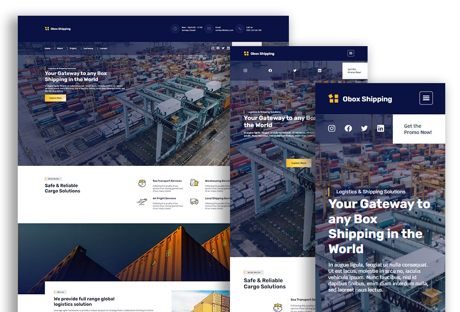

# Obox Shipping

A minimal landing page website portofolio built only using vanilla HTML, CSS, and JavaScript. The CSS file is generated using Live Sass Compiler. The website uses Obox Shipping as the imaginary sample company name.

## Purpose

The main purpose of this website is to exhibit the Obox Shipping company profile and the key services, such as:

1.  About the company
2.  List of the projects
3.  Slide of testimony
4.  Direct mailing contact
5.  Available on going promotional discount
6.  List of official social media

## Specification

1.  Mobile responssive
2.  Cross-browser ready

## How to Run

The only entry point is the `index.html`. Since this is a landing page, the project needs to be used as minimal as possible web pages for maintain its page speed. Therefore, to run this project locally, the steps are as simple as following below.

1.  Clone this project to your local
2.  Run the file `index.html` 
3.  Access it via browser
